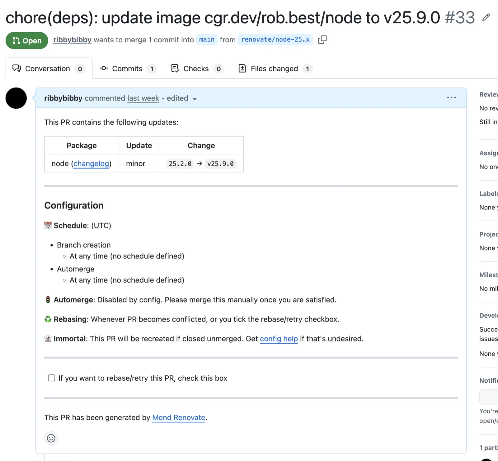
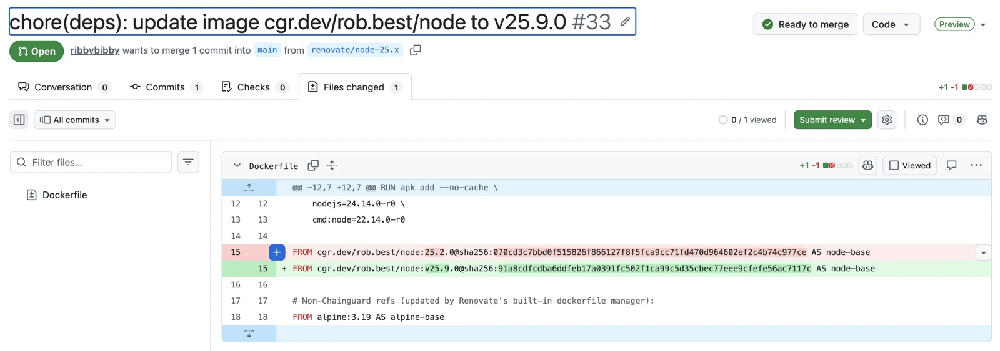
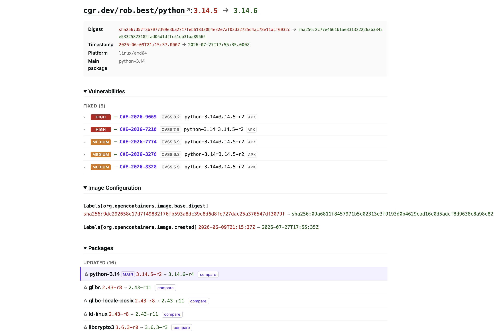
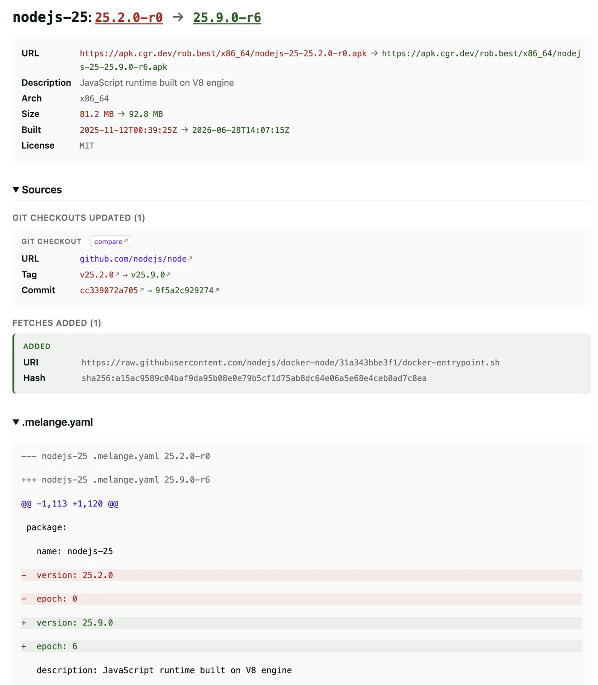

# Renovate Datasource

> [!WARNING]
> This project is developed by the Chainguard Professional Services team and maintenance is provided on a best-effort basis.

A [Renovate custom datasource](https://docs.renovatebot.com/modules/datasource/custom/)
for Chainguard images and APK packages.

It implements two features for both images and packages:

1. An optional cooldown that only surfaces updates at least *N*
   time in the past.
2. Detailed changelog URLs, via a custom UI that diffs the old and the new
   update.

## Screenshots

<table>
  <tr>
    <td align="center" width="50%">
      <a href="images/pr-body.webp"></a><br>
      <sub>Renovate PR body</sub>
    </td>
    <td align="center" width="50%">
      <a href="images/dockerfile-diff.webp"></a><br>
      <sub>Dockerfile diff</sub>
    </td>
  </tr>
  <tr>
    <td align="center" width="50%">
      <a href="images/image-diff.webp"></a><br>
      <sub>Image diff</sub>
    </td>
    <td align="center" width="50%">
      <a href="images/apk-diff.webp"></a><br>
      <sub>APK diff</sub>
    </td>
  </tr>
</table>

## Configuring Renovate

Refer to these pages for examples of configuring Renovate to use the datasource
in different scenarios:

- [Updating Images in Dockerfiles](docs/dockerfile-repo.md)
- [Updating APK Package Versions in Dockerfiles](docs/dockerfile-apk.md)

## Build

```
go build ./cmd/renovate-datasource
```

Or, build the container image:

```
docker build -t renovate-datasource:dev .
```

## Run

### Locally

Run the service locally and reuse the local credentials provided by `chainctl`:

```
# Login to Chainguard
chainctl auth login

# Run the service
./renovate-datasource --org=my.org.com
```

### Kubernetes

Deploy to Kubernetes with the provided [Helm chart](chart/).

Firstly, create an assumable identity as described in [the
documentation](https://edu.chainguard.dev/chainguard/administration/assumable-ids/identity-examples/kubernetes-identity/)
with the `registry.pull` and `apk.pull` roles. Assuming the service is
deployed to the `chainguard` namespace and the issuer URL of your cluster
is publicly available:

```
chainctl iam identity create renovate-datasource \
  --parent=<your-chainguard-org> \
  --identity-issuer=<your-cluster-oidc-issuer-url> \
  --subject=system:serviceaccount:chainguard:renovate-datasource \
  --role=registry.pull \
  --role=apk.pull
```

Note the printed identity UIDP — that's the value for `identity` below.

Then, install the chart, supplying your own org, identity UIDP and image details:

```
helm install renovate-datasource ./chart \
  --create-namespace \
  --namespace chainguard \
  --set org=<your-chainguard-org> \
  --set identity=<identity-uidp> \
  --set image.repository=<your-image-repo> \
  --set image.tag=<your-image-tag> \
  --set ingress.enabled=true \
  --set ingress.className=<your-ingress-class> \
  --set ingress.hostname=<your-ingress-hostname>
```

Omit the three `ingress.*` flags to skip Ingress (e.g. if you're exposing
the service through a mesh, a `LoadBalancer` Service (`--set
service.type=LoadBalancer`), or a `kubectl port-forward` for local testing).

## How It Works

### Cooldown

Disabled by default. Enable it either server-wide with `--cooldown=<duration>`
(e.g. `168h`) or per request via a `?cooldown=<duration>` query parameter on
`/releases`. The query parameter, when present, overrides the flag. When
used, it provides a view of the releases as of *N* time in the past.

#### Images

The datasource lists tags with
[`/registry/v1/tags`](https://edu.chainguard.dev/platform/api/spec-api-v1/#tag/registry/GET/registry/v1/tags)
and formats the results in the expected format.

```json
{
  "releases": [
    {
      "version": "3.14.5",
      "releaseTimestamp": "2026-06-10T20:18:06.42Z",
      "digest": "sha256:163cc24b066e0ea18daa4966227cdb8e61c2cf9f49681bc566459506901533a6"
    },
    {
      "version": "3.14.6",
      "releaseTimestamp": "2026-06-14T18:46:31.317Z",
      "digest": "sha256:d5312494fbc793de620941d10e2bc04f0c2ce67706b9da2071b297474218c719"
    }
  ]
}
```

Where the timestamp of a tag falls within the cooldown window, the tag history
API ([`/registry/v1/tags/{parentId}/history`](https://edu.chainguard.dev/platform/api/spec-api-v1/#tag/registry/GET/registry/v1/tags/{parentId}/history))
is used to rewind the tag back to the latest digest outside of the window.

If no historical digest satisfies the cooldown then the tag is omitted from the
results entirely.

#### APKs

The datasource pulls the APKINDEX for each of the organization's repositories
at startup and regularly refreshes it according to the value of
`--apk-index-refresh` (default `1h`).

```
https://apk.cgr.dev/<org-name>
https://virtualapk.cgr.dev/<org-id>/chainguard
https://virtualapk.cgr.dev/<org-id>/extra-packages
```

It uses the `t:` field in the index as the `releaseTimestamp` and omits versions
where the timestamp falls inside the cooldown window.

```json
{
  "releases": [
    {
      "version": "3.14.5-r0",
      "releaseTimestamp": "2026-06-10T20:18:06.42Z",
    },
    {
      "version": "3.14.6-r1",
      "releaseTimestamp": "2026-06-14T18:46:31.317Z",
    }
  ]
}
```

This supports provides and prefixed capabilities as well:
1. For instance `nodejs` will return all versions for the packages that provide it
   (`nodejs-26`, `nodejs-25` etc)
2. And `cmd:gcloud`, which will return versions for `google-cloud-sdk`.


### Changelogs

#### Images

The datasource hosts a site at `/repo/{repo}/diff/{fromRef}/{toRef}` which
compares the image configuration, SBOMs and apko definitions of the two
tags/digests.

The page also surfaces the changes in vulnerabilities between the two images by
scanning both SBOMs with `grype`. This behaviour can be disabled with
`--grype-scan=false`.

#### APKs

The datasource hosts a site at
`/apk/{fromName}/version/{fromVer}/diff/{toName}/version/{toVer}` that
extracts and compares the `.melange.yaml` and `.PKGINFO` files from the
control-section of the APK packages.
